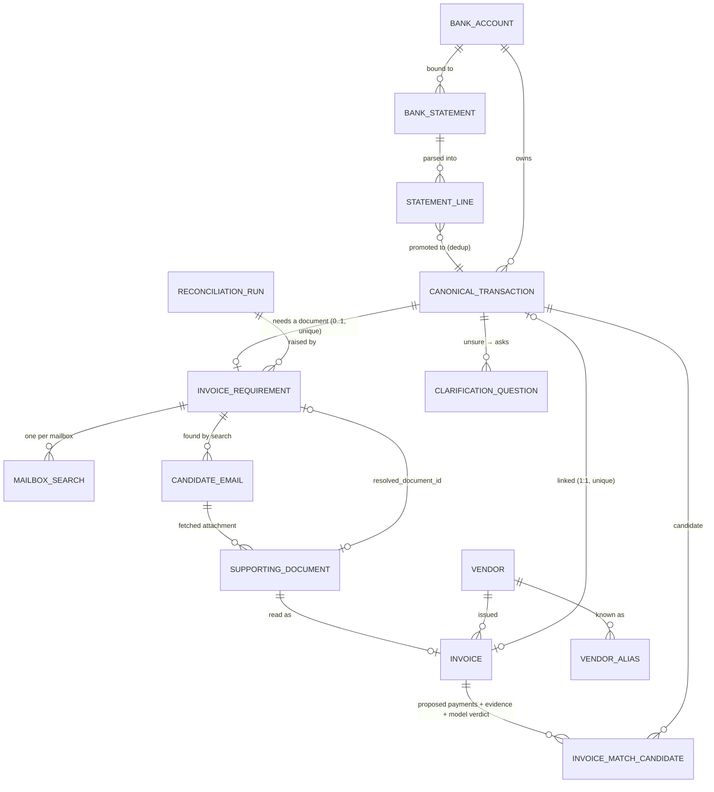
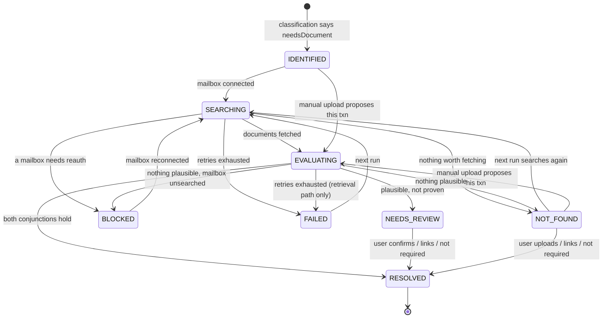

# Ledgerwick: System Map and Quality Boundaries

Status: working document for the end-to-end testing phase · 2026-09-27 · written from the code at `02166c8`

## How to read this document

This document describes Ledgerwick as it exists in the code today. It does not describe what the architecture document says it should become. Where the two differ, it follows the code and says so. It has four parts, and each builds on the one before.

Part I is the map. It covers the stages, the events that connect them, where state lives, and where models, Gmail and people come in. Part II goes through each stage in turn and asks where quality can degrade and how you would know. Part III sorts the problems found into system failures, quality failures and product limitations, and ranks where effort pays off first. Part IV sets out a way of thinking about end-to-end testing, so that a run through Ledgerwick produces a measurement and not just an impression.

Tags such as **[A]**, **[B]** and **[C]** on a finding refer to the three failure classes you defined: system failure, quality failure and product limitation.

---

# Part I — The System as Built

## 1. The one-paragraph mental model

Ledgerwick is a chain of nine Inngest functions connected by nine events. It writes everything it learns into Postgres, so the database is the only place the truth lives. Each function is a thin shell around a pure-ish module that takes a `WorkspaceScope` and injected model calls. That is why nearly all the logic can be tested without Inngest or a provider. Models are called in exactly seven places, all through one gateway (`src/ai/model.ts`). None of them writes state directly. Every model answer goes through a Zod schema and then through deterministic code that decides what it means. Wherever a wrong answer would be silent, code prefers to ask the user instead of acting. Automatic links are made only by a *conjunction*: every term must hold, and one missing term sends the item to review.

The flow of value is short:

```text
Statement ─► Transactions ─► Requirements ─► Documents ─► Invoices ─► Links ─► Report
```

Everything else in the system exists to make one of those arrows reliable, idempotent or explainable.

## 2. The pipeline diagram

The diagram below shows the whole system. The colour of each node tells you what kind of work happens there:

- blue is deterministic code
- orange is a model call
- green is a person
- grey is an external system
- purple is an Inngest function boundary

Edge labels are the event names that carry work between functions.

```mermaid
flowchart TD
  classDef code fill:#dbeafe,stroke:#1d4ed8,color:#0b1b3a
  classDef ai fill:#ffedd5,stroke:#c2410c,color:#3a1a05
  classDef human fill:#dcfce7,stroke:#15803d,color:#052e14
  classDef ext fill:#f3f4f6,stroke:#6b7280,color:#111827
  classDef fn fill:#f3e8ff,stroke:#7e22ce,color:#2e1065
  classDef db fill:#fef9c3,stroke:#a16207,color:#3a2a05

  U1["User uploads statement(s)"]:::human --> R1["POST /api/statements<br/>bytes → Vercel Blob<br/>bank_statements = UPLOADING"]:::code
  R1 -- "statement/uploaded (one per file)" --> F1

  subgraph S1["Stage 1 · Identify & bind"]
    F1["identify-statement"]:::fn --> A1["identify-statement.v2<br/>bank · account id · kind · currency · period"]:::ai
    A1 --> C1["bind to bank account<br/>(case-insensitive identity)"]:::code
  end
  C1 -- "no id / unknown currency" --> H1["NEEDS_ACCOUNT<br/>user picks account"]:::human
  H1 -- "statement/bound" --> F2
  C1 -- "statement/bound" --> F2

  subgraph S2["Stage 2 · Parse, validate, promote"]
    F2["parse-statement"]:::fn --> C2["read source: CSV / text PDF → grid<br/>no text → SCAN path"]:::code
    C2 -- "TEXT" --> A2["map-statement-columns.v1<br/>columns + locators, from 45 head / 15 tail rows<br/>(skipped if same bytes were mapped before)"]:::ai
    C2 -- "SCAN" --> A3["read-scanned-statement.v1<br/>model reads VALUES"]:::ai
    A2 --> C3["walk rows · parse amounts & dates"]:::code
    A3 --> C3
    C3 --> C4["balance equation + running-balance chain<br/>TEXT only: one re-derive on mismatch"]:::code
    C4 --> C5["promote → canonical_transactions<br/>identity + occurrence index"]:::code
  end
  C5 -- "batch settled & produced rows<br/>reconciliation/requested" --> F3

  subgraph S3["Stage 3 · Identify invoice requirements"]
    F3["identify-requirements<br/>(one run per workspace)"]:::fn --> C6["unjudged transactions<br/>→ batches of 20"]:::code
    C6 --> A4["classify-transactions.v1<br/>+ all Business Knowledge"]:::ai
    A4 --> C7["rules: CREDIT never · unsure → question<br/>write requirement IDENTIFIED<br/>set judged_at"]:::code
  end
  C7 -- "unsure" --> H2["Clarification questions<br/>user answers"]:::human
  H2 -- "reconciliation/requested" --> F3
  C7 -- "retrieval/requested" --> F4

  subgraph S4["Stage 4 · Gmail retrieval"]
    F4["request-retrieval<br/>fan-out"]:::fn -- "retrieval/requirement (one per req)" --> F5
    F5["retrieve-documents"]:::fn --> C8["search: VENDOR + KEYWORD passes<br/>±7 days · has PDF · metadata only · ≤25/pass"]:::code
    C8 <--> G1["Gmail API"]:::ext
    C8 --> C9["select ≤5 messages by header evidence"]:::code
    C9 --> C10["fetch PDF attachments → Blob<br/>supporting_documents"]:::code
    C10 <--> G1
  end
  C10 -- "retrieval/fetched" --> F6

  subgraph S5["Stage 5 · Understand + match + settle"]
    F6["assess-retrieval<br/>(one step per document)"]:::fn --> A5["read-invoice.v1<br/>printed text → code parses"]:::ai
    A5 --> C11["vendor resolve · invoice row<br/>duplicate check"]:::code
    C11 --> C12["candidate transactions<br/>invoice date −3 / +10 days"]:::code
    C12 --> A6["adjudicate-match.v1<br/>(same-invoice.v1 for duplicates)"]:::ai
    A6 --> C13["matching conjunction (8 terms)"]:::code
    C13 --> C14["settle conjunction (5 terms)<br/>→ link via linkInvoice"]:::code
  end

  U2["User uploads invoice"]:::human --> R2["POST /api/documents"]:::code
  R2 -- "document/stored" --> F7["understand-document"]:::fn
  F7 --> A5b["read-invoice.v1"]:::ai
  A5b -- "invoice/extracted" --> F8["match-invoice"]:::fn
  F8 --> C12b["candidates → adjudicate → conjunction<br/>AUTO_MATCHED or NEEDS_REVIEW"]:::code

  C14 --> DB[("Postgres (Neon)<br/>invoice_requirements.state")]:::db
  C12b --> DB
  DB --> H3["Review screen<br/>confirm · reject · no doc needed · link by hand"]:::human
  H3 --> C15["learning: confirmed alias,<br/>Business Knowledge"]:::code
  C15 --> DB
  DB --> C16["Missing Invoice Report<br/>(live derived view)"]:::code
  C16 -- "export/requested" --> F9["generate-export → .xlsx → Blob"]:::fn
```



One thing is easy to miss in this picture. The pipeline has **two ways in for invoices** and only **one way to write a link**. Invoices arrive either from Gmail (Stage 4 → 5) or by hand (`document/stored`). Both go through the same reader (`understandDocument`) and the same candidate generator. Every resolution, whether automatic or user-made, goes through `src/matching/link.ts`, and that is where the `isNull(resolutionMethod)` guard and the one-to-one unique index live.

## 3. The event chain: who retries what, and what happens when they give up

This is the table to keep open while you debug. Each row is one Inngest function. The last three columns answer three questions you asked directly: what gets retried, what happens when retries run out, and what gets written as state.

| Function | Trigger → emits | Concurrency | Retries | When retries are exhausted | State it owns |
|---|---|---|---|---|---|
| `identify-statement` | `statement/uploaded` → `statement/bound` | none | 3 | statement `FAILED` ("something went wrong on our side") | `bank_statements`, `bank_accounts` |
| `parse-statement` | `statement/bound` → `reconciliation/requested` | none | 3 | statement `FAILED`, and the batch is still announced so the other files reconcile | `statement_lines`, `canonical_transactions`, period |
| `identify-requirements` | `reconciliation/requested` → `retrieval/requested` | 1 / workspace | 3 per step (one step per batch) | run `FAILED`; batches already judged stay judged | `reconciliation_runs`, `invoice_requirements`, `clarification_questions` |
| `request-retrieval` | `retrieval/requested` → `retrieval/requirement` ×N | 1 / workspace | 3 | nothing recorded | none |
| `retrieve-documents` | `retrieval/requirement` → `retrieval/fetched` | 1 / workspace | 3; config errors are non-retriable | requirement `FAILED` | `mailbox_searches`, `candidate_emails`, `supporting_documents` |
| `assess-retrieval` | `retrieval/fetched` | 1 / workspace | 3 per document step | requirement `FAILED` | `invoices`, `invoice_match_candidates`, requirement state |
| `understand-document` | `document/stored` → `invoice/extracted` | 1 / workspace | 3 | **nothing**: the document stays in `EXTRACTING`/`CLASSIFYING` (deliberate, per state-machines §3) | `supporting_documents`, `invoices`, `vendors` |
| `match-invoice` | `invoice/extracted` | 1 / workspace | 3 | **nothing** (deliberate) | `invoice_match_candidates`, requirement state |
| `generate-export` | `export/requested` | none | 3 | export `FAILED` | `reconciliation_exports` |

Beneath these function-level retries sits a second layer inside the model gateway. Each model call gets a 150-second budget and one in-call retry. A model that **never answered** (timeout, gateway without credit, rate limit) throws, so Inngest retries it. A model that **answered unusably** (`NoObjectGeneratedError`) returns `{ok:false}`, and the caller records that as an outcome and does not retry. This distinction is the backbone of the system's failure handling. It is also why "the gateway has no credit" shows up as `FAILED`/"our fault" and never as "unreadable document".

There is one deliberate semantic retry. On the TEXT parse path, a statement that does not reconcile gets **one re-derive** of its column mapping, and the model is told which rows broke the running balance. The scanned path never gets one (ADR 0003).

Two properties of this table shape latency more than anything else. First, **five of the nine functions are serialised per workspace**, and Inngest applies that limit to steps as well as runs. So classification batches run one after another, and retrieval handles one requirement at a time. Second, every step runs inside a Vercel function that is **killed at 300 seconds without warning**. That limit is why batches are 20 transactions and why model calls are capped at 150 seconds.

## 4. The data spine: how transactions, requirements, documents, invoices and matches relate

The diagram below leaves out auth and exports and shows only the tables the pipeline reasons over. The two relationships that matter most are marked in its notes: a canonical transaction has **at most one** requirement, and an invoice links to **at most one** transaction. Both are enforced by unique indexes, not by code checks.



This gives you the vocabulary to answer "where did this number come from?". A row in the report is a requirement. Its transaction came from one or more statement lines, and its state was last written by either retrieval's settle step, the manual-upload matcher, or the review screen. `resolution_method` tells you which of these made the link: `AUTO_RETRIEVED`, `AUTO_MATCHED`, `USER_CONFIRMED`, `USER_LINKED` or `NOT_REQUIRED`.

## 5. The requirement state machine, as the code actually moves it

The Missing Invoice Report reads this state machine, so it is the one that matters most. The labels below are the transition names in `src/retrieval/requirement-state.ts` and `src/matching/match.ts`.



For the report, these states collapse into buckets (`src/report/summary.ts`): `matched`, `notRequired`, `needsReview`, `notFound`, `blocked`, and `waiting`. **`FAILED` falls into `waiting`**, alongside `IDENTIFIED`, `SEARCHING` and `EVALUATING`. Keep that in mind, because it comes back in Part III.

## 6. Where each thing you asked about lives

This section answers your checklist directly, so you can find each item without reading the whole document.

1. **Where state is persisted.** Postgres holds all domain state and Vercel Blob holds all bytes. Inngest holds only memoised step results, which are the replay cache for a retry. It is never the source of truth. The frontend polls the database.
2. **Where Inngest is involved.** Everything after an upload or a button press (§3).
3. **Where Gmail is queried.** Only in `retrieve-documents`, and only through `src/gmail/mail.ts`. Search uses metadata format. The one full-format request is `attachmentsOf`, for selected messages. `tests/gmail/boundary.test.ts` enforces that no model code can import Gmail, and the other way round.
4. **Where manual invoices enter.** `POST /api/documents` → `document/stored`. If the user uploaded from a transaction's review screen, the document is pre-bound, and `match-invoice` links it as `USER_LINKED` without matching.
5. **Deterministic code vs AI.** There are exactly seven prompts: `identify-statement.v2`, `map-statement-columns.v1`, `read-scanned-statement.v1`, `classify-transactions.v1`, `read-invoice.v1`, `adjudicate-match.v1` and `same-invoice.v1`. By default they all use `anthropic/claude-sonnet-5` through AI Gateway, which can be overridden with `AI_MODEL`. Everything else is code.
6. **Guardrails.** Zod schemas on every answer, including one `superRefine` on classification. "Locators, not values" for column mapping (0009) and invoice fields (0010). A text anchor check that the characters a model reported actually appear in the document. The balance equation plus the running-balance chain. Two conjunctions that never turn a model opinion into a link on their own. Unique indexes for idempotency and one-to-one links. `WorkspaceScope` on every query, plus isolation tests.
7. **Logging.** `[timing]` lines for every stage and every model call, with prompt id, version, model, tokens and outcome. `[parse]` report lines, with the full parse report also persisted in `bank_statements.column_mapping.report`. `failure_reason` on statements. Evidence and model verdict/reason on every match candidate. Header evidence on every candidate email. Outcome and `truncated` on every mailbox search. §9 covers what is *not* logged.
8. **Human intervention.** There are six points: `NEEDS_ACCOUNT`, clarification questions, `NEEDS_REVIEW`, `NOT_FOUND`, `BLOCKED` (reconnect), and duplicate-invoice questions. None of them holds a workflow open; the state *is* the pause.
9. **Where the final report is generated.** `src/report/report.ts` is a live read over requirement state, and nothing is cached. The Excel file is a snapshot built by `generate-export`.

---

# Part II — Quality Boundaries, Stage by Stage

## 7. What a "quality boundary" is here

A quality boundary is a point where one stage hands a claim to the next, and the next stage trusts it. At each boundary there are three questions. Can the claim be wrong? Would anything notice? Does the error stop here, or does it flow downstream looking like correct data? The last question matters most. An error that becomes a `FAILED` state is cheap, because someone sees it. An error that becomes a plausible row is expensive, because nobody does.

For each stage the analysis follows the same order: responsibility, inputs and outputs, what can go wrong, how it is detected, whether it propagates, what protects it, what to measure, and where the leverage is.

## 8. The stages

### Stage 1 — Statement identification and account binding

**Responsibility.** Decide whether a file is a statement, and bind it to exactly one bank account in the workspace. **Input:** file bytes (the whole PDF, or the first 8 KB of a CSV). **Output:** a `bank_account_id`, the account kind, and a declared period (or none).

**What can go wrong.**

- **[B] Account identity drift.** Suppose the model reads the account identifier differently across two uploads, for example masked `XXXX1234` one time and the full number the next. `bindAccount` then creates a second account. Canonical identity includes the bank account, so every transaction in the overlap becomes a duplicate, and the dedup guarantee in Stage 2 is bypassed without any error.
- **[B] Wrong declared period.** Rows that print only day and month take their year from the declared period. A period read a year off shifts every such date. The balance equation cannot see dates.
- **[A/C] Large PDFs.** The whole document goes to the model for a question that only needs the first page. This costs money and latency, and very large scans risk the 150-second budget.

**Detection.** Missing identifier or unknown currency → `NEEDS_ACCOUNT` (good). Not a statement → `FAILED` with an explanation (good). Nothing detects drift or a wrong period.

**Propagation.** Drift and wrong periods are **silent** and flow all the way to the report.

**Protection.** Tests on the binding branches. There is no eval of identification on its own.

**Signals to track.** Accounts per workspace compared with what the user expects. New accounts created per upload after the first. Statements whose derived date range falls outside their declared period.

**Leverage.** A cheap, deterministic guard: warn when a new account is created at a bank where the workspace already has one, or when parsed dates fall outside the declared period. Both would turn a silent error into a visible question.

### Stage 2 — Parsing, validation and canonical promotion

**Responsibility.** Turn a document into complete, correct statement lines, then into deduplicated canonical transactions. **Input:** the grid (TEXT) or the bytes (SCAN), plus the account currency and the declared period. **Output:** `statement_lines`, `canonical_transactions`, and a validation outcome of `VALID` or `DISCREPANCY`.

This is the best-guarded stage in the system and also the one with the most recorded real-world failures: 0 of 5 first-attempt passes in `parsing-acceptance.md`. Both facts are true at once, because the guard it has, the balance equation, has blind spots of exactly the shape that parsing tends to fail in.

**What can go wrong.**

- **[B] Truncation above `firstDataRow`.** The mapping model sees 45 head rows and 15 tail rows of a grid that may have hundreds. If it sets `firstDataRow` too late, the rows above it are never visited. The opening balance can then be derived from the first *surviving* row, so the truncated walk reconciles against its own truncation (log entry #5). `excludedRows` now *reports* transaction-like rows above the start, but it only reports them. It does not demote the outcome.
- **[B] Descriptions from the wrong column, or blank ones.** Balances still reconcile (ICICI, 80% blank). The damage shows up two stages later, because classification and retrieval both reason from the description.
- **[B] Mapping instability across files.** A pinned mapping is reused only for **byte-identical** re-uploads. Two different downloads that cover overlapping periods are mapped independently. If they choose different description columns, the normalised descriptions differ and the overlap **duplicates**, because canonical identity includes the description. This already happened with identical bytes (212 duplicates, ICICI) before pinning was added. Pinning fixed identical bytes, not overlapping files.
- **[B] Scanned values misread.** This is accepted by design. It leads to `DISCREPANCY` and is never retried.
- **[A] Large scanned statements.** One model call with the whole document, capped at 150 seconds, inside a 300-second step. After three retries it becomes `FAILED` ("our fault"). A long scan can therefore fail systematically, and the user is told it was our fault.

**Detection.** The balance equation, and the chain audit where the statement prints running balances. The parse report is logged and persisted. `NO_TRANSACTIONS` and `STRUCTURE_UNREADABLE` both lead to `FAILED`.

**Propagation.** This is the key finding for this stage. **A `DISCREPANCY` statement still reaches `COMPLETED`, and its transactions flow into classification, retrieval and the report as if they were trusted.** `validationOutcome` is read only on the statement batch page. The report and the Excel export do not carry it, so an accountant reading the export cannot tell which rows came from a statement the system itself distrusts.

**Protection.** A strong unit and integration suite (walk, dates, balance chain, promote, parse). The parse bench. The acceptance log with its six-in-a-row streak. **There are no golden files.** `fixtures/expected/` is empty, and the eight real statements are all in the git-ignored `inbox/`, unredacted. The testing strategy calls golden files "the most valuable test asset in the repository", and that asset does not exist yet.

**Signals to track.** Row recall compared with a human count. Share of `DISCREPANCY` outcomes. Share of blank or duplicated descriptions. `excludedRows.count > 0`. Re-derive rate. Duplicate rate on overlapping uploads.

**Leverage.** In order of cost-effectiveness:

1. Make `excludedRows > 0` demote a statement to `DISCREPANCY`.
2. Carry the statement's trust level down to the requirement, the report and the export.
3. Give each of the eight statements a golden file, starting with the five from the log.
4. Pin mappings per **account layout**, not per byte hash, so overlapping downloads from the same bank map the same way.

### Stage 3 — Invoice requirement identification

**Responsibility.** Decide which debits need a supporting document, and ask about the ones the model cannot judge. **Input:** unjudged transactions (description, formatted amount, date, account name) plus **every** Business Knowledge fact. **Output:** `invoice_requirements` (with `reason`, `vendor_guess`, `business_context`), clarification questions, and `judged_at`.

This stage deserves more attention than it currently gets, because it produces the **denominator of the entire product**. Every number in the report is a count of requirements. A requirement that should exist and does not is a missing invoice the product never mentions. That is the most silent failure in the whole system.

**What can go wrong.**

- **[B] False negative: `needsDocument=false` for a payment that needed one.** Silent and terminal. `judged_at` is set, so the transaction is never looked at again unless a question about it is answered.
- **[B] False positive.** The user sees noise and resolves it as `NOT_REQUIRED`. This is recoverable, and it teaches the system something.
- **[B] A poor `vendor_guess`.** This is the hidden coupling in the system. Retrieval's VENDOR pass searches Gmail for *this string*. A wrong or null guess drops retrieval to the KEYWORD pass alone (Stage 4).
- **[B] Unstable judgement.** Your own bench found Haiku and Sonnet disagreeing on 53 of 85 transactions. That does not show which one is right, because the bench has no labels. It does show that this is a high-variance judgement.
- **[B] Repeated questions across batches.** "Ask once per vendor" only holds within a batch of 20 (ADR 0018).
- **[A] A batch fails its schema.** The run still reaches `COMPLETED` if any batch succeeded. `batchesFailed` is returned but **not persisted** on the run. The skipped transactions stay unjudged until the next `reconciliation/requested`, which only fires on a new upload or an answered question. There is no scheduled pick-up.
- **[C/cost] Prompt growth.** Every batch carries all Business Knowledge. This is fine now, but the prompt grows without limit as the workspace learns.

**Detection.** Schema failure is caught per batch. Nothing detects a wrong judgement.

**Protection.** Schema tests, identification tests, and the classify bench, which compares models but has no ground truth.

**Signals to track.** Requirement **recall** and precision against a labelled set (recall matters more). Question rate per 100 transactions, and repeated questions per vendor. Share of requirements with a null `vendor_guess`. `NOT_REQUIRED` resolution rate, which is a live proxy for false positives. Batch failure rate. Tokens per transaction.

**Leverage.** High. A labelled set of your own statements, with each debit marked "needs a document: yes/no" and a vendor name, gives you precision and recall here. It also gives you `vendor_guess` accuracy, which is retrieval's input. Persisting `batchesFailed` on the run is a one-line change that removes a silent partial result.

### Stage 4 — Gmail search and selection

**Responsibility.** Find the email that carries this payment's invoice, and download it without downloading too much else. **Input:** transaction date, `vendor_guess`, and aliases whose key appears in the description. **Output:** `mailbox_searches` (outcome, `truncated`), `candidate_emails` (header evidence, `selected`), and fetched `supporting_documents`.

**What can go wrong.**

- **[C] HTML-only receipts** (no PDF) are invisible, because `has:attachment filename:pdf` is part of every query. This is a known open decision.
- **[C] Invoices outside ±7 days**, in unconnected mailboxes, behind vendor portals, or sent as links.
- **[B] Weak vendor names.** Only the VENDOR pass uses names. Without a good `vendor_guess` or a known alias, recall depends on the KEYWORD pass, which relies on luck.
- **[B→A] Truncation and cap bias toward review.** This is probably the most consequential finding in the document, and it is **a hypothesis to measure, not a fact**. The KEYWORD pass asks for *any* PDF with "invoice / receipt / bill / tax invoice / payment confirmation" across a 15-day window of the whole mailbox. A real business inbox can easily hold more than 25 such emails, which sets `truncated`. Separately, any subject containing an invoice word counts as a signal, so more than 5 signalled messages makes the selection non-exhaustive. **Either condition blocks every automatic link from retrieval** (settle term "nothing found was left unread"). Both also cost money, because every download means one `read-invoice` call and usually one `adjudicate-match` call. The eval suite would not see this, because its scripted mailboxes are small.
- **[A] Auth vs. transient failures.** These are handled well: `NEEDS_REAUTH` leads to `BLOCKED`, and a 5xx leads to a retry.

**Detection.** `mailbox_searches.truncated`, `messagesFound`, `candidate_emails.selected`. All are persisted and queryable. This stage is well instrumented.

**Protection.** Query tests, a boundary test, and a labelled eval of messy mailboxes with an "agree with everything" adjudicator. That proves **zero false positives come from the policy alone**, which is a strong guarantee. Recall on real mail is unmeasured (BAN-157).

**Signals to track.** Share of searches with `truncated=true`. Share of requirements with a non-exhaustive selection. Retrieval recall (the invoice was in the mailbox → was it found → was it selected → was it fetched). Downloads per requirement. Documents fetched that turned out not to be invoices.

**Leverage.** High, and cheap to check. One SQL query over `mailbox_searches` and `candidate_emails` after your first real run tells you whether the review rate is driven by truncation. If it is, the fixes are small. You could run the KEYWORD pass only when the VENDOR pass finds nothing. You could stop counting KEYWORD-only truncation against the settle term when the VENDOR pass was exhaustive and found exactly one document. Or you could require vendor evidence before a message counts as a "signal" for the cap.

### Stage 5 — Document understanding (invoice extraction)

**Responsibility.** Classify a document as an invoice or not (three-valued), and read vendor, number, date, total and currency. **Input:** PDF text if there is any, otherwise the bytes. **Output:** document `state` and `classification`, an `invoices` row, and vendor plus inferred aliases.

**What can go wrong.**

- **[B] Mislocation.** The model reads the subtotal, or a different date, correctly but from the wrong line. The anchor check passes, because those characters do appear in the document. ADR 0010 names this limit itself.
- **[B] The visual path has no anchor.** For scans and photos there is no text to check the reading against.
- **[B] Vendor resolution.** Inferred aliases are written from the invoice's own names. They then count as `ALIAS` evidence in matching, and that is enough for the vendor term of the auto-match conjunction. It is safe only as long as the invoice's names are right.
- **[A] Stuck documents (manual path).** A document left in `EXTRACTING`/`CLASSIFYING` after its retries run out is deliberately not marked failed, and it is still manually linkable. A *retrieved* document gets another chance, because the next run's assessor calls `understandDocument` again and that function resumes mid-state documents. An *uploaded* one never produces an invoice, and nothing re-queues it.

**Detection.** Schema, parse and anchor checks lead to `UNREADABLE`. `NOT_AN_INVOICE` and `UNCERTAIN` stay distinct.

**Propagation.** A misread total usually fails the zero-tolerance amount term, so it becomes a review and not a wrong link. That is a quality cost rather than a correctness cost. A misread date within 3 days does not change the outcome.

**Protection.** Fields and understanding tests, and the understand bench. The acceptance log is empty (BAN-150): **extraction has never been measured on a real invoice**, and there is one invoice in `fixtures/`.

**Signals to track.** Field accuracy per field. Share of `UNREADABLE`, `UNCERTAIN` and `NOT_AN_INVOICE`. Anchor failures. Documents stuck mid-state for more than an hour.

**Leverage.** Medium, but required before any number from matching means anything. The truth set only has to be a few dozen of your own invoices from the mailbox you will test with.

### Stage 6 — Matching and settlement

**Responsibility.** Decide whether an invoice pays a transaction: link it, ask, or say nothing was found. **Input:** invoice facts, and transactions in the window from 3 days before to 10 days after the invoice date. **Output:** `invoice_match_candidates` (evidence, model verdict and reason), a link, and the requirement state.

An **automatic link** needs *all* of the following. The first eight terms are matching's; the last five are retrieval's settle terms.

1. There is exactly one surviving candidate.
2. The shortlist was not truncated.
3. The invoice is not a suspected duplicate.
4. Currency is the same.
5. The amount matches exactly (tolerance 0).
6. The dates are within 3 days.
7. The vendor is known (`RESOLVED` or `ALIAS`).
8. The model agrees with the same candidate.
9. Exactly one plausible document exists for the payment.
10. Matching chose this payment.
11. The document reads as `IS_INVOICE`.
12. Every mailbox was searched.
13. Nothing found was left unread.

**What can go wrong.**

- **[B] False positive.** This is guarded about as well as it can be before measurement. The remaining risk is recurring charges with the same amount and a known vendor, where last month's invoice falls inside this month's window. The eval set includes that shape.
- **[B/C] Excessive review.** This is the expected main failure mode, and it is intended. Watch which term blocks most often.
- **[C] Cross-currency payments can never auto-link.** A USD invoice paid from an INR account fails "the same currency" and "the amount matches" every time. For an Indian SaaS-buying business this may be a large share of all requirements. It is a product decision, not a bug. It becomes a question for you once you see how large that share is.
- **[C] One-to-one only.** One payment covering several invoices, or one invoice paid in instalments, cannot be represented.
- **[B] Candidate window.** An invoice dated more than 3 days *after* the charge (end-of-period invoicing) never proposes that charge.
- **[A] Stranded `EVALUATING` on the manual path.** `match-invoice` sets the anchor requirement to `EVALUATING` and restores the previous state in a `catch`. A 300-second platform kill never reaches the `catch`. Every later attempt then reads `EVALUATING` as the "previous state". So if the kill is followed by retries that also fail, which is exactly what happens during a provider outage, the requirement ends up in `EVALUATING`. There is no `onFailure` to rescue it, so it is counted as "waiting" and never shown in the action queue.

**Detection.** Every candidate's evidence and the model verdict are persisted. **The term that blocked an automatic link (`blockedBy`) is not persisted.** It exists only in the bench output. You cannot yet ask the production database "why did 60% of requirements go to review?"

**Protection.** Decide tests that remove each term in turn, threshold tests, duplicates tests, the retrieval eval with an "agree with everything" model, and the matching bench. The acceptance log is empty.

**Signals to track.** Auto-link **precision** (the target is 100%, and any false positive is an incident). Auto-link rate. Review rate, **broken down by blocking term**. Share of candidates whose `modelVerdict` disagrees with the evidence.

**Leverage.** Persist `blockedBy` (and the settle term) on the requirement. It is the cheapest high-value change in this document, because it turns every run into a histogram of why automation stopped.

### Stage 7 — Review, learning and the report

**Responsibility.** Let the user close what automation could not, learn from it, and present a report that is truthful about what is missing. **Input:** requirement states and the user's decisions. **Output:** links, confirmed aliases, Business Knowledge, the report and the export.

**What can go wrong.**

- **[A] `FAILED` is shown as "We hit a problem — we'll retry", but nothing schedules a retry.** No function has a cron trigger. The requirement is searched again only when the next `reconciliation/requested` or `retrieval/requested` fires, which means a new upload, an answered question or a reconnected mailbox. The report puts it in "waiting", so a stuck item looks like work in progress.
- **[A] "Run completed" does not mean "pipeline finished".** `reconciliation_runs.state = COMPLETED` is written when **classification** finishes. Retrieval and assessment happen afterwards. The state-machine doc says `COMPLETED` means every requirement needs no further automated work, but the code does not mean that. Nothing tells the user, or your test harness, when a workspace has actually become quiet.
- **[B] The report is honest about counts but not about trust.** Rows from `DISCREPANCY` statements, requirements that went to review because of truncation, and transactions that were never judged because a batch failed all look the same as everything else.
- **[B] Learning quality.** A confirmed alias turns `NONE` into `RESOLVED` next time, and this is the loop that should push the auto-link rate up over time. It depends on processor-prefix stripping, and the list of processors is closed.

**Protection.** Report, summary, isolation and export tests.

**Signals to track.** Time until the workspace is quiet. Items in "waiting" older than an hour. Auto-link rate on the *second* month for the same workspace compared with the first, which is the learning curve.

---

# Part III — Classification and Where to Start

## 9. The A / B / C ledger

This section gathers the findings above into your three classes, so you can see at a glance which ones to fix, which to measure, and which to decide on.

### A. System failures (objectively broken, or unable to report its own state)

| # | Finding | Where | Effort |
|---|---|---|---|
| A1 | Run `COMPLETED` is written before retrieval starts; there is no signal that the workspace is quiet | `identify.ts` `finishRun`; no run-level retrieval tracking | Small–medium |
| A2 | `FAILED` promises "we'll retry", but no scheduler exists | `inngest/functions` (no cron); `summary.ts` puts FAILED in waiting | Small (daily sweep function) |
| A3 | `match-invoice` can strand a requirement in `EVALUATING` after a platform kill | `match.ts` catch/restore; no `onFailure` | Small |
| A4 | `batchesFailed` is not persisted; partial classification looks complete | `identify.ts` / `reconciliation_runs` | Tiny |
| A5 | `blockedBy` / settle term not persisted; review causes cannot be queried | `invoice_requirements` | Tiny |
| A6 | Large scans can fail systematically against the 150 s / 300 s budget, and are reported as "our fault" | `parse.ts` SCAN path, `model.ts` | Medium (page-chunking) |
| A7 | Manually uploaded documents can be left mid-state with nothing to re-queue them | `understand-document` (deliberate) | Small (the A2 sweep covers it) |

### B. Quality failures (runs cleanly, answer is worse than it should be)

| # | Finding | Silent? |
|---|---|---|
| B1 | Parse truncation above `firstDataRow` is reported but does not demote the outcome | Yes |
| B2 | `DISCREPANCY` statements feed the report and export unmarked | Yes |
| B3 | Overlapping, non-identical downloads can map descriptions differently → duplicates | Yes (shows up as repeated rows) |
| B4 | Account identifier drift creates a second account → duplicates | Yes |
| B5 | Classification false negatives drop invoices from the report entirely | **Yes, the most silent failure in the system** |
| B6 | A weak or null `vendor_guess` degrades retrieval recall | Yes |
| B7 | KEYWORD-pass truncation and the 5-message cap likely force review and add model spend | Visible in data, not in the UI |
| B8 | Extraction mislocation; no anchor on the visual path | Mostly becomes review |
| B9 | The −3-day candidate window misses invoices dated after the charge | Becomes NOT_FOUND / review |

### C. Product limitations (correct behaviour, missing information or scope)

1. HTML-only email receipts and vendor-portal or link-only invoices.
2. Invoices outside ±7 days, or in mailboxes and sources that are not connected.
3. Cross-currency payments, which can never auto-link under the current policy (a deliberate choice).
4. One payment covering many invoices, or one invoice paid in instalments (the one-to-one invariant).
5. Credits and refunds, which never create requirements (out of scope in V1).
6. Scanned statements, where accuracy is capped by vision reading (accepted in ADR 0003).

Keeping class C separate protects you from one specific trap. If you "fix" a class-C item by loosening a matching term, you have turned a limitation into a false-positive risk. A class-C item should be counted in the evaluation as **"correctly not automated"**, and it becomes a *roadmap* question only once its share is large.

## 10. The optimisation map

The chain you proposed fits the code, with one addition. **Vendor identity** is a boundary of its own, because it is created in Stage 3 (`vendor_guess`), consumed in Stage 4 (search terms), created again in Stage 5 (vendor and aliases), and decides a conjunction term in Stage 6.

```text
Input ─► Identify/bind ─► Parse ─► Promote ─► Classify ─► [Vendor identity] ─► Search/select ─► Extract ─► Match/settle ─► Report
```

In the table below, ● means a strong effect, ◐ a moderate one and ○ little or none. Each row asks what improving that boundary would do.

| Boundary | Downstream accuracy | LLM cost | Latency | Reliability | Diagnosability | Less ambiguity | User outcome |
|---|---|---|---|---|---|---|---|
| Identify / bind | ◐ (dedup) | ◐ (send page 1 only) | ◐ | ○ | ○ | ○ | ◐ |
| Parse completeness | ● | ○ | ○ | ○ | ◐ | ○ | ● |
| Promote / identity | ● (duplicates) | ○ | ○ | ◐ | ○ | ○ | ◐ |
| Classify | ● (denominator) | ● (80% of tokens are thinking) | ● (serial batches) | ◐ | ◐ | ● | ● |
| Vendor identity | ● | ◐ | ○ | ○ | ◐ | ● | ● |
| Search / select | ● (recall) | ● (downloads × 2 calls) | ● | ○ | ◐ | ◐ | ● |
| Extract | ◐ | ○ | ○ | ○ | ◐ | ◐ | ◐ |
| Match / settle | ◐ (already strict) | ○ | ○ | ◐ (A3) | ● (A5) | ○ | ● (review load) |
| Report / run state | ○ | ○ | ○ | ● (A1, A2) | ● | ○ | ● (trust) |

### What to optimise first

These are ranked by improvement per unit of effort, given that you are about to run real data through the system. The first two cost almost nothing and change what every later run can tell you, so they come before any tuning.

1. **Make runs self-explaining (A1, A4, A5).** Persist `blockedBy` and the settle term on the requirement. Persist `batchesFailed` on the run. Add a derived "workspace is quiet" check. Roughly half a day of work. After this, every end-to-end run produces a breakdown instead of a feeling.
2. **Close the silent-stuck paths (A2, A3, A7).** A single daily Inngest cron that re-sends `retrieval/requested` for workspaces holding `FAILED` requirements. It should also reset `EVALUATING` or `SEARCHING` rows older than about an hour, and re-emit `document/stored` for documents stuck mid-state. This makes the report's "we'll retry" true.
3. **Measure retrieval truncation on your first real mailbox (B7).** One query. If the hypothesis holds, it is the single biggest driver of review rate and model spend, and the policy change is small.
4. **Label your own statements for classification (B5, B6).** This gives precision and recall for requirements plus `vendor_guess` accuracy. It is the denominator of the product, and it is currently judged by a model with no truth set behind it.
5. **Propagate parse trust (B1, B2).** Demote on `excludedRows`, and carry `DISCREPANCY` into the report and the export.

Later: pinning by account layout (B3), a guard against account drift (B4), classification v2 at lower reasoning (already planned in ADR 0018), page-chunking for scans (A6), and the product decisions on cross-currency and HTML receipts, taken once their share is known.

---

# Part IV — The Testing and Evaluation Model

## 11. Two questions, never mixed

Every end-to-end run answers two separate questions, and the harness should report them separately:

1. **Did the system behave?** This is system correctness, class A. It is binary. One violation is a bug, and a bug becomes a deterministic regression test.
2. **How good was the answer?** This is quality, class B, measured against ground truth. It produces numbers that move, and it is evaluated and tracked, not asserted.

Class C items are counted in the second report as "correctly not automated", so they never masquerade as quality failures.

## 12. What a successful end-to-end run means

A run **passes system correctness** when the workspace reaches quiescence and all of the following hold:

1. Every statement is `COMPLETED`, `FAILED` or `NEEDS_ACCOUNT`, and none is in `UPLOADING`, `IDENTIFYING`, `PARSING` or `VALIDATING`.
2. No reconciliation run is `RUNNING`.
3. No requirement is in `SEARCHING` or `EVALUATING`, and any `FAILED` requirement has an explanation in the logs.
4. No supporting document is in `STORED`, `EXTRACTING` or `CLASSIFYING`.
5. Every unjudged transaction is accounted for by an open question or a recorded batch failure.
6. Re-running the same inputs (re-upload the statements, re-send `retrieval/requested`) produces **zero** new transactions, requirements, documents, invoices or candidate sets.
7. The invariants hold: no transaction has two invoices, no invoice has two transactions, and the summary buckets sum to the number of requirements.

A run is then **scored for quality** against the truth file (§14):

| Metric | Stage | Bar to aim for |
|---|---|---|
| Row recall; description completeness | Parse | 100% on text; ≥ 99% usable descriptions |
| Duplicate canonical transactions on overlapping uploads | Promote | 0 |
| Requirement recall / precision | Classify | Recall first; you set the bar after the first labelled run |
| `vendor_guess` correct | Classify | Measure first |
| Retrieval recall, as a funnel: in mailbox → found → selected → fetched | Search | Measure first |
| Field accuracy (total, date, vendor, number) | Extract | ≥ 95% on total |
| **Auto-link precision** | Match | **100%. One false positive is an incident** |
| Auto-link rate; review rate by blocking term | Match | Watch the trend; no fixed bar |
| End-to-end "correctly accounted" rate | All | The headline number |

"Correctly accounted" is the product's end-to-end metric. It is the share of debits whose final state is right. That means: linked to the right invoice, correctly marked as needing no document, or correctly in review or not-found because the invoice truly is not reachable (class C). It is the one number that improves only when the user's outcome improves.

## 13. When a run fails: what to inspect, in order

Walk **upstream from the symptom**. Stop at the first stage whose output is already wrong, because everything after it is working correctly on bad input. The table maps each symptom to where the evidence is kept.

| Symptom in the report | First place to look | Then |
|---|---|---|
| A payment you know needed an invoice is not in the report at all | `invoice_requirements` for that transaction. If absent, check `canonical_transactions.judged_at` and `clarification_questions` | Is the transaction itself present? (`statement_lines`, parse report `excludedRows`) |
| Duplicate rows | `canonical_transactions` grouped by date + amount; compare `bank_account_id` and `description_normalized` | `bank_accounts` for drift; `column_mapping.mapping` of the two statements |
| Went to review when it should have auto-linked | `invoice_match_candidates` evidence + `model_verdict` (and `blockedBy`, once persisted) | `mailbox_searches.truncated`, `candidate_emails.selected` |
| `NOT_FOUND` but the invoice is in Gmail | `candidate_emails` for the requirement: was the message found at all? | If not found: `vendor_guess`, window dates, whether it has a PDF (class C?). If found but not selected: header evidence. If fetched: the document's `state` and `classification`, then the invoice fields |
| Linked to the wrong payment | **Stop and log it as an incident.** Candidate evidence + model reason | The invoice fields against the PDF; the vendor alias that carried it |
| Stuck "waiting" | Requirement `state`, `updated_at`; Inngest run history for that `requirementId` | `[timing] outcome=threw` lines around that time |
| Statement `DISCREPANCY` | Persisted parse report: `differenceMinor`, chain breaks, `excludedRows` | `bench/out/<statement>/grid.txt` beside the PDF |

A **run manifest** is worth adding: one JSON file your harness writes per run, containing every row id created and the state it ended in. It turns this walk into a diff.

## 14. What a good test dataset contains

The dataset is **one or two real workspaces with a truth file**, not a pile of fixtures. The truth file is the expensive part and the only part a person has to do. It records, per transaction, what the right final outcome is.

```yaml
statements:
  - file: hdfc-2026-07.pdf
    expected_rows: 85
    expected_closing: "1,23,456.78"
transactions:            # every DEBIT
  - date: 2026-07-14
    amount: "1,699.00"
    description_contains: ANTHROPIC
    needs_document: true
    vendor: Anthropic
    document:            # where the invoice really is, or why it is unreachable
      source: gmail      # gmail | upload | none
      message_subject: "Your receipt from Anthropic"
      reachable: true    # false → class C, with a reason
      reason: null       # html_only | outside_window | other_mailbox | fx | ...
  - date: 2026-07-15
    amount: "25,000.00"
    description_contains: SELF TRANSFER
    needs_document: false
```

What should be in it, deliberately:

1. **Your real statements**, including at least one overlapping pair from *different downloads* (this tests B3) and one scan.
2. **Your real mailbox** (the BAN-157 test mailbox) for the same period, with nothing tidied.
3. **Every shape you care about.** Recurring same-amount subscriptions. A USD invoice on an INR card. An invoice forwarded by a colleague. A receipt that exists only as HTML. A payment through Razorpay. An invoice dated after the charge. A transfer to your own account. A loan EMI. A credit card bill payment.
4. **Traps for false positives.** Two invoices from the same vendor within the window. Last month's invoice arriving in this month's window.
5. **Manual uploads** for a handful of requirements, including one duplicate of a Gmail-retrieved invoice.

Thirty to fifty labelled debits is enough to start seeing the shape. You can extend the file every time a run surprises you.

## 15. Which failures become regression tests, and of which kind

The rule follows from the A / B / C split.

1. **Every class-A failure becomes a deterministic test** in `tests/`, written before the fix. These are state transitions, idempotency, stuck states, and invariants: exactly what the existing suite is good at.
2. **Every class-B failure becomes a fixture or an eval case, not a unit test**, unless the root cause turns out to be a deterministic bug (such as a date parser that cannot read `44.079.83`). In that case the bug gets a unit test *and* the document stays in the eval. A statement that parsed wrong becomes a golden file. An invoice that was misread becomes an entry in the extraction truth set. A retrieval miss becomes a labelled mailbox case in `tests/retrieval/world.ts`.
3. **Class-C cases are recorded in the truth file as `reachable: false`** with a reason, so they are scored as "correctly not automated" and never tuned against.

## 16. Deterministic tests, AI evaluations, and the benchmark

**Deterministic tests**, which run in CI on every commit, cover everything that does not call a model: walk, dates, amounts, balance chain, promotion identity, both conjunctions, state transitions, isolation, idempotency, report bucketing, and golden-file parsing *given a stored mapping*. The last item is the important one. Once a mapping is cached (the benches already cache them), a golden parse test is fully deterministic. It still catches every walk or reader regression, and it costs nothing.

**AI evaluations**, which run deliberately and are committed with the change, cover each prompt against its own labelled set:

- mapping accuracy (per statement)
- classification precision and recall (per debit)
- extraction field accuracy (per invoice)
- adjudication agreement (per candidate set)

The benches already have the right shape. Each has a cache, can be edited by hand, and asserts nothing. What they lack is the truth file to score against.

**The benchmark** is the end-to-end scorecard from §12, computed over the truth file. It is run before any prompt, model or threshold change is accepted, and the result is recorded next to the change. This is the "run it repeatedly and measure where it fails" loop you described. Its output should be a small table with two columns, this run and the previous run, and one row per metric in §12, with auto-link precision always in the first row.

## 17. Evaluate each stage on its own, or only through the whole?

A stage is evaluated **independently** when its output can be checked by a person without running the rest of the pipeline, and when it is both a model call and upstream of something important. That applies to:

- parsing (a line count and totals)
- classification (a yes/no per debit)
- extraction (fields per invoice)
- retrieval selection (was the right email among those selected)

Each needs its own truth set, because an end-to-end number cannot tell you *which* of them moved.

Some behaviours are evaluated **only through end-to-end outcomes**. This covers anything whose correctness is emergent: settlement, the learning loop, the queue, and "correctly accounted". Settlement is a conjunction over the other stages, so testing it in isolation mostly re-tests the unit tests. The learning loop only exists across two runs, which is why the benchmark should include month one *and* month two for the same workspace. The auto-link rate climbing between them is the single best sign that the product works.

## 18. The loop you are building toward

1. Run the truth-file workspace through the whole pipeline.
2. Wait for quiescence, then check §12's system list. Any violation is class A: write the test, fix it, and go back to step 1.
3. Score quality against the truth file. Find the earliest stage whose metric dropped or is lowest.
4. Walk the evidence for its worst examples (§13). Classify each as B or C.
5. For B: add the case to that stage's truth set, change one thing, run that stage's eval, then the benchmark. Keep the change only if auto-link precision stays at 100% and the headline number moves.
6. For C: record it in the truth file with a reason. If the reasons pile up, you have a product decision.

---

## Open questions this document leaves for you

- **Cross-currency.** Once you see its share of requirements, is "always review" the right policy, or is it worth an FX-band term that permits a link when the vendor is `RESOLVED`?
- **KEYWORD-pass truncation.** If the first real mailbox confirms it, which policy do you prefer: run KEYWORD only as a fallback, or exclude KEYWORD-only truncation from the settle term?
- **What "run completed" should mean to the user.** Should the run stay `RUNNING` until retrieval settles, or should there be a separate "workspace is quiet" status?

*(Your brief was cut off at "…fix the highest-impact failure modes, and ensure". I have assumed it ended with something like "ensure they stay fixed", which is what §15 and §18 address. If you meant something else, tell me.)*
